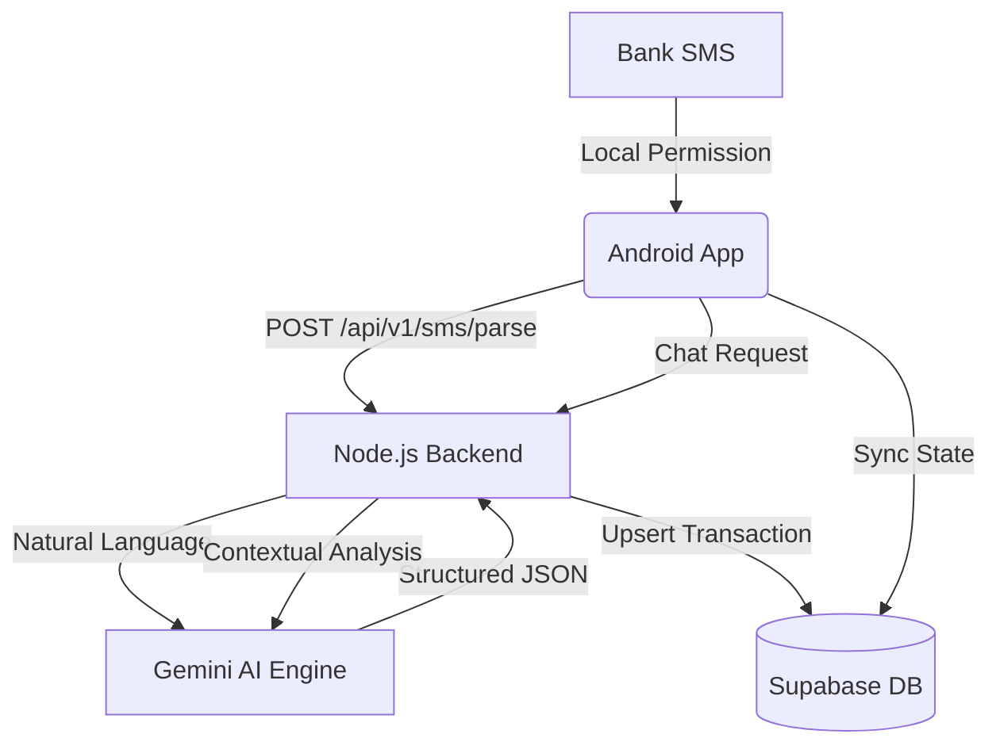

<div align="center">


# 💳 FinPath
### The Personal Finance OS for the AI Era

> 🏆 **Built for [ai4impact Hackathon 2026](https://github.com/Yaser-123/Finpath)**  
> 👥 **Team: CodeVizards** — *Lords Institute of Engineering and Technology*

[](https://developer.android.com/)
[](https://nodejs.org/)
[](https://supabase.com/)
[](https://deepmind.google/technologies/gemini/)
[](LICENSE)

[📲 Download APK](#) • [🔗 LinkedIn](https://www.linkedin.com/in/mohamedyaser08/) • [📧 Contact](mailto:1ammar.yaser@gmail.com)

</div>

---

## 🎯 The Vision

In a world of fragmented bank accounts, hidden subscriptions, and complex digital payments, keeping track of money is harder than ever. **FinPath** is a decentralized, AI-driven financial intelligence layer that lives on your phone. 

It autonomously transforms your existing bank SMS data into a structured financial roadmap—providing real-time insights, personalized AI advising, and actionable wealth-building tools without ever requiring your bank credentials.

---

## 💡 Our Solution

FinPath bridges the gap between raw financial activity and strategic wealth management using a 3-layer intelligence engine:

1.  **Autonomous Ingestion**: A zero-friction SMS sync engine that parses bank notifications into structured ledger entries.
2.  **AI Insight Engine**: Google Gemini 2.5 Flash analyzes your spending patterns to provide personalized advice and anomaly detection.
3.  **Educational Core**: Integrated financial literacy modules and quizzes to build long-term generational wealth.

---

## ✨ Key Features

| Feature | Description |
|---|---|
| 📡 **Autonomous SMS Sync** | Scans and parses bank SMS (Axis, etc.) to track income/expenses automatically with 99% accuracy. |
| 🤖 **AI Financial Advisor** | Chat with Gemini to ask questions like "How much did I spend on food last week?" or "Can I afford a new laptop?" |
| 📊 **Premium Analytics** | Beautiful Vico-powered charts for spending trends, category breakdowns, and net-cash flow. |
| 🎮 **Financial Literacy Quiz** | Interactive quizzes with visual results (Donut Charts) and detailed review sections for learning. |
| 🏆 **Goal Tracking** | Track "Generational Wealth" steps including Emergency Funds and personalized savings goals. |
| 🛡️ **Security-First** | Powered by Supabase with Row Level Security (RLS) and end-to-end encrypted sessions. |

---

## 🖼 Screenshots & Demo

<div align="center">

| Dashboard | AI Chat | Data Sync | Finance Quiz |
|:---:|:---:|:---:|:---:|
|  |  |  |  |

</div>

---

## ⚙️ Tech Stack

| Layer | Technology |
|---|---|
| **Android CLI/UI** | Kotlin, Jetpack Compose, Vico Charts, Lottie Animations |
| **Backend API** | Node.js, Express (REST) |
| **Database/Auth** | Supabase (PostgreSQL, RLS, JWT Auth) |
| **AI Orchestration** | Google Gemini 2.5 Flash-Lite |
| **Networking** | Retrofit, OkHttp, Supabase-KT |

---

## 🏗 System Architecture



---

## 🚀 Getting Started

### 1. Backend Setup (Node.js)
```bash
cd backend
npm install
# Configure your .env
SUPABASE_URL=your_url
SUPABASE_SERVICE_ROLE_KEY=your_key
GEMINI_API_KEY=your_gemini_key
npm start
```

### 2. Android App Setup
1. Open the project in **Android Studio Ladybug or later**.
2. Update the `BASE_URL` in your network configuration to point to your backend IP.
3. Build and Run on a physical device (to allow SMS access).
4. **Important**: Grant SMS Read permissions when prompted to enable autonomous syncing.

---

## 🫂 The Team: CodeVizards

**Institution**: Lords Institute of Engineering and Technology

| Role | Name | Contact |
|---|---|---|
| **Team Lead** | T Mohamed Yaser | [LinkedIn](https://www.linkedin.com/in/mohamedyaser08/) |
| **Member** | Mohammed Sabeehuddin | [Email](mailto:sabeehuddin05@gmail.com) |

---

## 🏆 Hackathon Details (ai4impact)
- **Problem Statement**: Financial AI for impact-driven personal wealth management.
- **Team ID**: 1ammar.yaser
- **Submission Date**: 18 Apr 2026

Built with ❤️ by **CodeVizards** — *Making finance accessible, one algorithm at a time.*
