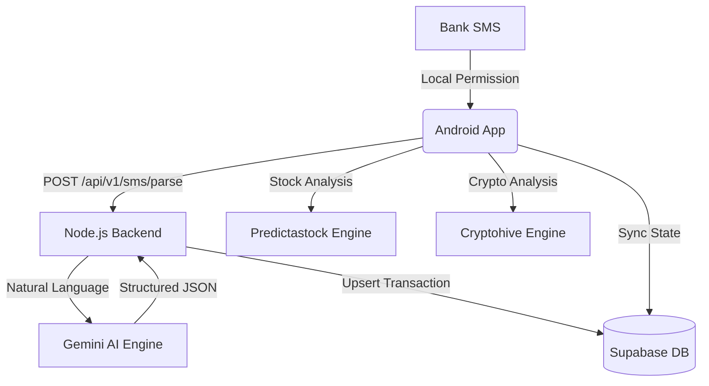

# 💳 FinPath: AI-Powered Behavioral Wealth Architect
### The Personal CFO for the AI Era

> 🏆 **Smart India Hackathon (SIH) 2026 Proposal**  
> 👥 **Team: CodeVizards** — *Lords Institute of Engineering and Technology*

[📲 Download APK](https://drive.google.com/file/d/1rd4QTPZqYWYhKsdaLC6bi3yuviojxxqi/view?usp=sharing) • [🔗 LinkedIn](https://www.linkedin.com/in/mohamedyaser08/) • [📧 Contact](mailto:1ammar.yaser@gmail.com)

---

## 1. About Team & Problem Statement

*   **Problem Statement Title**: FinPath: AI-Powered Behavioral Wealth Architect
*   **Vision**: An autonomous "Personal CFO" that manages the gap between "Daily Spending" and "Generational Wealth."
*   **Theme/SDG**: Fintech / Smart Automation (SDG 8: Decent Work and Economic Growth)
*   **Category**: Software
*   **Team Name**: CodeVizards
*   **College Name**: Lords Institute of Engineering and Technology
*   **Team Lead**: T Mohamed Yaser

---

## 2. Technical Approach

### Technologies Used
*   **Frontend**: Kotlin, Jetpack Compose, Vico Charts (Android)
*   **Backend**: Node.js, Express, Render (Cloud Deployment)
*   **Database & Auth**: Supabase (PostgreSQL with Row Level Security)
*   **AI Engine**: Google Gemini 2.5 Flash-Lite (Behavioral Analysis)
*   **External Analysis**: Streamlit (Advanced Portfolio Modeling)

### Methodology & Process
1.  **Autonomous Ingestion**: App captures bank SMS via local background listeners.
2.  **Intelligence Layer**: Backend extracts merchant and amount data using Gemini LLM.
3.  **Behavioral Architecture**: The system categorizes transactions and maps them against "Generational Wealth" goals.
4.  **Portfolio Integration**: Direct links to specialized analysis engines for Stocks and Crypto.

### IDEA to Prototype Steps
*   **Phase 1**: Developed the SMS parsing regex and local database schema.
*   **Phase 2**: Integrated Gemini 2.5 for natural language transaction categorization.
*   **Phase 3**: Built the Jetpack Compose dashboard and portfolio analysis modules.

---

## 3. Feasibility and Viability

### Key Features
*   🚀 **Zero Manual Entry**: No need to type transactions; the app reads your bank notifications.
*   📈 **Stock & Crypto Portfolio Analysis**: Deep-dive modeling via integrated Streamlit engines.
    *   [Stock Predictastock](https://predictastock.streamlit.app/)
    *   [Crypto Hive](https://cryptohive.streamlit.app/)
*   🤖 **AI Advisor**: Real-time chat for financial planning and anomaly detection.
*   🛡️ **Privacy First**: No bank credentials or sensitive account numbers ever leave the phone.

### Challenges & Strategies
*   **Challenge**: Varied SMS formats from different banks.
*   **Strategy**: Using Gemini AI to generalize parsing instead of rigid regex patterns.
*   **Challenge**: Maintaining real-time sync on low-end devices.
*   **Strategy**: Lightweight Node.js backend hosted on Render for fast global response times.

---

## 4. Impact and Benefits

*   **Social Impact**: Democratizes financial advising, providing premium "Wealth Manager" features to the underserved.
*   **Economic Impact**: Reduces impulsive spending by visualizing the "Opportunity Cost" of daily expenses.
*   **Novelty**: Unlike competitors, FinPath requires **zero bank integrations** (API/Plaid), making it compatible with 100% of Indian banks.

---

## 🏗 System Architecture

---

## 🖼 Screenshots

| Dashboard | AI Chat | Data Sync | Finance Quiz |
|:---:|:---:|:---:|:---:|
|  |  |  |  |

---

## 🚀 Research and References
*   [Google Gemini API Documentation](https://ai.google.dev/)
*   [Supabase Row Level Security Guide](https://supabase.com/docs/guides/auth/row-level-security)
*   [Jetpack Compose Design Patterns](https://developer.android.com/jetpack/compose)

Built with ❤️ by **CodeVizards** — *Architecting generational wealth.*
